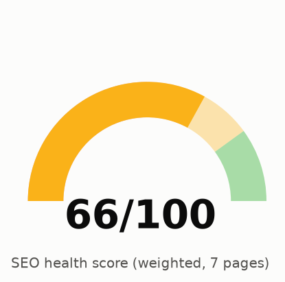
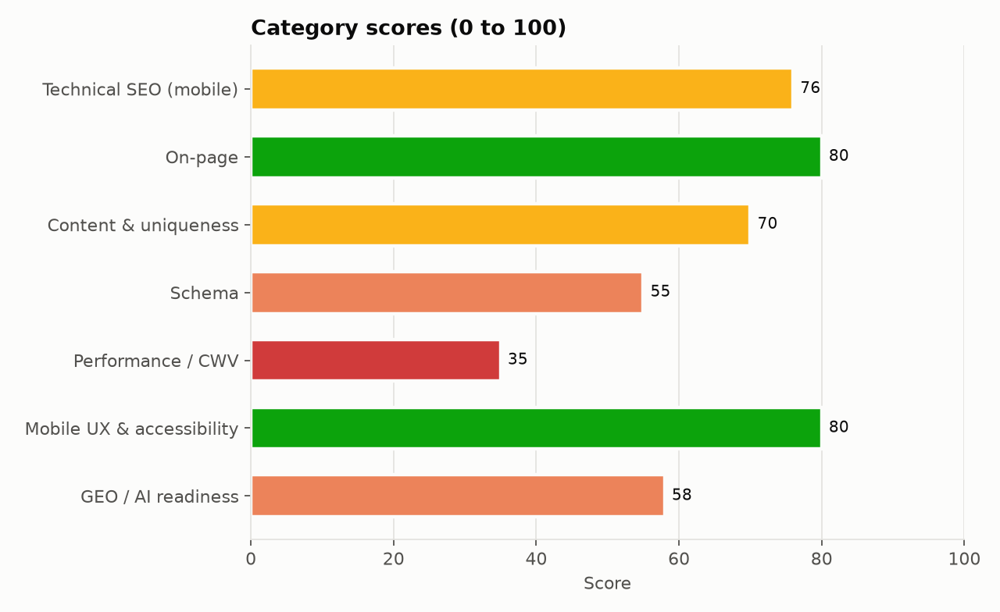
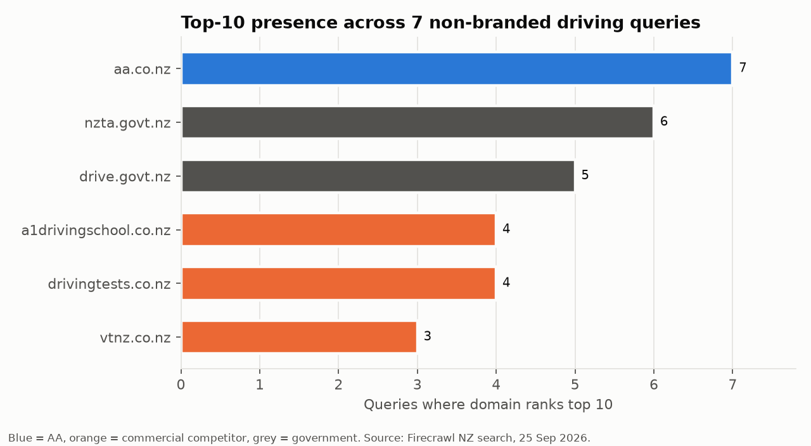
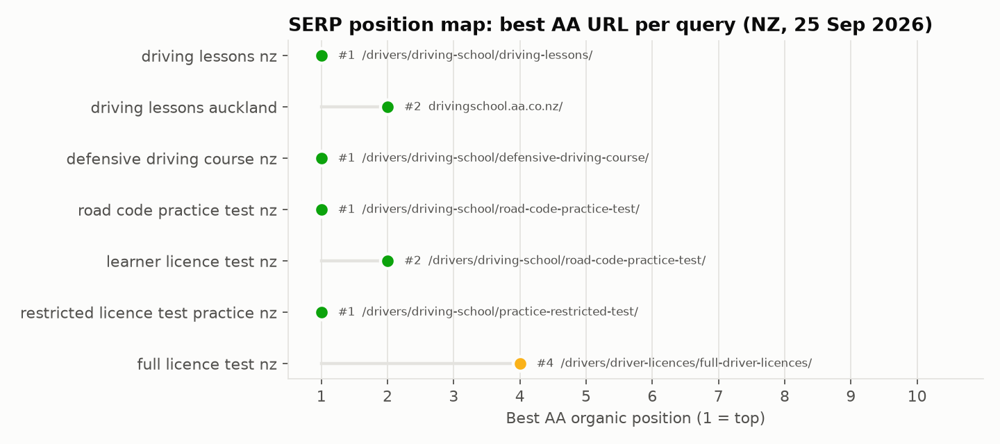
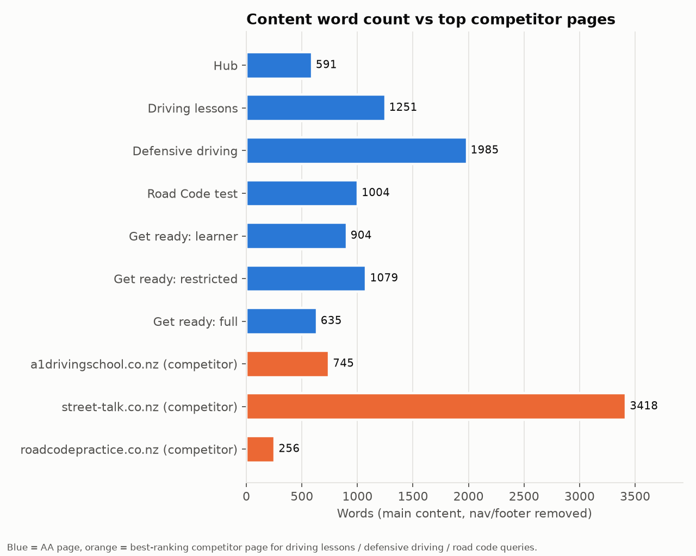
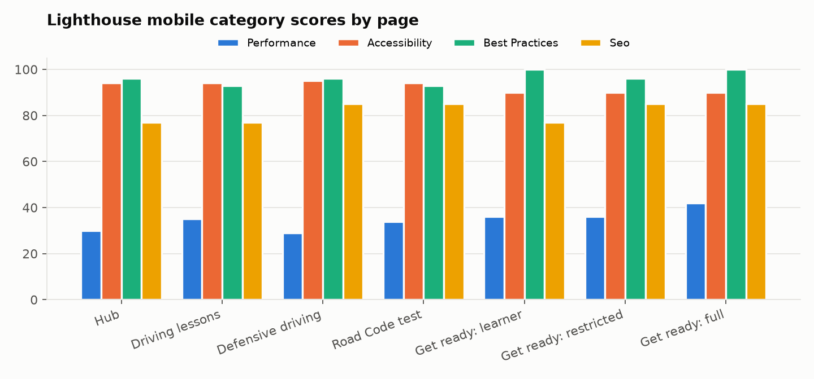
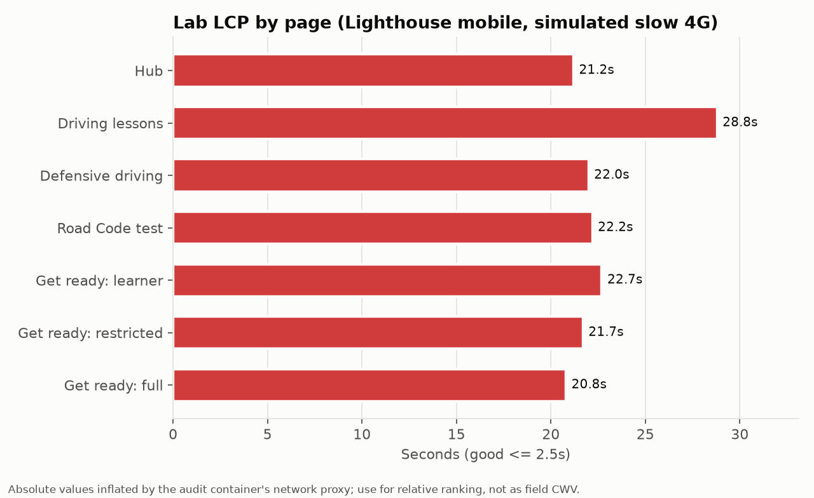
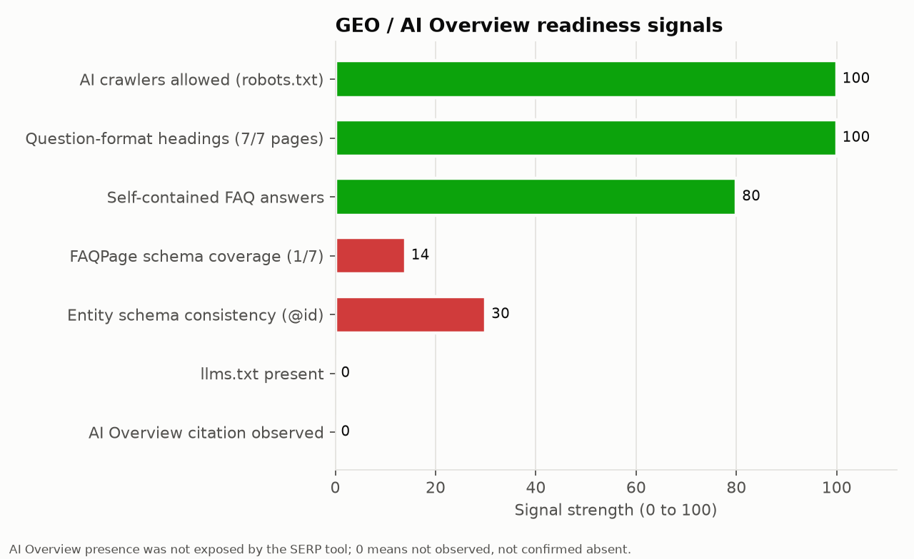
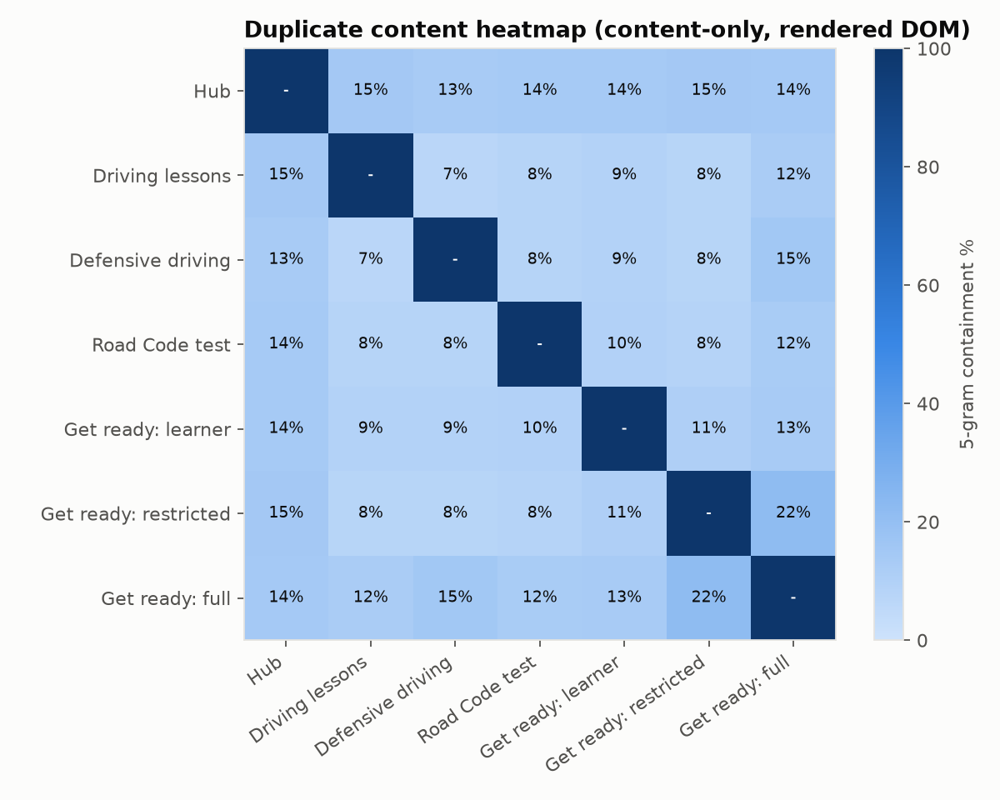

# AA Driving School: Mobile-First SEO Audit (7 pages)

**Site:** aa.co.nz/drivers/driving-school/ · **Audit date:** 25 September 2026 · **Scope:** 7 selected pages · **Priority:** mobile-first (390px) · **GBP:** skipped by instruction

| # | Page | URL |
|---|---|---|
| 1 | Hub | https://www.aa.co.nz/drivers/driving-school/ |
| 2 | Driving lessons | https://www.aa.co.nz/drivers/driving-school/driving-lessons/ |
| 3 | Defensive driving | https://www.aa.co.nz/drivers/driving-school/defensive-driving-course/ |
| 4 | Road Code test | https://www.aa.co.nz/drivers/driving-school/road-code-practice-test/ |
| 5 | Get ready: learner | https://www.aa.co.nz/drivers/driving-school/get-ready-for-learner-test/ |
| 6 | Get ready: restricted | https://www.aa.co.nz/drivers/driving-school/get-ready-for-restricted-test/ |
| 7 | Get ready: full | https://www.aa.co.nz/drivers/driving-school/get-ready-for-full-test/ |

## 1. Executive Summary



**Overall SEO health: 66/100.** The seven pages are well built on the basics. Each has one clear H1, a unique title and meta description, a self-referencing canonical, an XML sitemap entry, indexable status and server-rendered content, so the static HTML matches the rendered DOM. AA holds **#1 for "driving lessons nz", "defensive driving course nz" and "road code practice test nz"** in today's NZ SERP sample. The score is held down by three problems.

1. **Mobile performance is the biggest risk.** Lighthouse mobile performance averages **35/100** on all 7 pages. About 3.1 to 4.2 MB ships per page. Google Tag Manager alone blocks the main thread for about 0.8s, and two GA4 tags load. reCAPTCHA (~180 KB unused JS) and an eager YouTube embed (~1 MB, driving-lessons) load on content pages, and a Material Symbols icon font sits on the critical path. The absolute lab times are inflated by the audit container's network proxy, but TBT (543 to 1,402 ms) and the JS/byte findings do not depend on the network. They are real.
2. **Intent cannibalisation across licence stages, not duplicate text.** Text overlap between the 7 pages is low (7% to 22% 5-gram containment). The problem is that each licence stage has 3 or 4 AA URLs chasing the same intent. For example, "restricted licence test practice nz" ranks `/practice-restricted-test/`, not `/get-ready-for-restricted-test/`. "full licence test nz" ranks `/drivers/driver-licences/full-driver-licences/` at #4, and `/get-ready-for-full-test/` is not in the top 10. In June 2026 SEMrush had `/get-ready-for-full-test/` at #5.
3. **Schema is thin and inconsistent for an entity as strong as AA.** Five of 7 pages carry a bare `Service` node with no offers, audience or area detail. No page has `BreadcrumbList`. `FAQPage` appears only on the hub, although 6 pages show visible Q&A blocks. Two conflicting Organization `@id`s are in use. The Road Code page sits under a "Free NZ Road Code Practice Test" title but marks up a paid `Product` ($12.50 to $20), a title/offer mismatch.

**Top 5 actions:** (1) Defer or remove third-party JS on content pages: GTM consolidation, lazy reCAPTCHA, YouTube facade. (2) Assign one primary URL per licence stage and differentiate or consolidate the rest. (3) Retitle the Road Code page so "free" describes only the trial. (4) Make canonical and og:image URLs absolute. (5) Start the schema programme: entity `@id`, BreadcrumbList, Course/Offer, FAQPage. This is a multi-sprint investment, not a quick win.



*Chart data, top to bottom:*

- Technical SEO (mobile): 76
- On-page: 80
- Content & uniqueness: 70
- Schema: 55
- Performance / CWV: 35
- Mobile UX & accessibility: 80
- GEO / AI readiness: 58


**Scoring method.** Weighted rubric: Technical SEO (mobile) 20%, Content and uniqueness 20%, On-page 15%, Performance/CWV 15% (mean Lighthouse mobile performance score), Schema 10%, Mobile UX and accessibility 10%, GEO/AI readiness 10%. Because the performance input comes from proxy-inflated lab data, the overall score is conservative. With field CWV it would probably land about 5 to 8 points higher.

## 2. Keyword Opportunity Table

Positions are **live NZ SERP observations (Firecrawl search, 25 Sep 2026, top 10)**. Volumes are the **historical SEMrush NZ snapshot from June 2026** (prior audit). SEMrush MCP was not connected for this run, so treat the volumes as directional.

| Keyword | NZ vol. (SEMrush, Jun 2026) | AA best URL today | Pos. today | Pos. Jun 2026 | Opportunity |
|---|---|---|---|---|---|
| learning license test | 8,100 | /road-code-practice-test/ | n/a | 2 | Protect; drivingtests.co.nz holds #1 |
| driving test nz | 6,600 | /road-code-practice-test/ | n/a | 5 | Needs a clear "which driving test?" answer block on the hub |
| full licence test nz | 4,400 | /drivers/driver-licences/full-driver-licences/ | 4 | 5 (get-ready-for-full-test) | **High:** get-ready-for-full-test has dropped out of the top 10; consolidate |
| book full license test | 4,400 | not ranking | n/a | n/a | **High:** add "how to book" steps + NZTA/VTNZ booking links on get-ready-for-full-test |
| restricted license test | 4,400 | /practice-restricted-test/ | n/a (#1 for "restricted licence test practice nz") | 19 | **High:** decide primary URL between get-ready and practice-restricted |
| defensive driving course | 4,400 | /defensive-driving-course/ | 1 | 1 | Protect: CLS 0.13 and TBT are the main risks |
| book restricted test | 3,600 | not ranking | n/a | n/a | **High:** same fix as "book full license test" on get-ready-for-restricted-test |
| learners licence nz | 3,600 | /drivers/driver-licences/learner-driver-licences/ | n/a | 3 | Medium: get-ready-for-learner-test is not the ranking URL |
| road code | 2,400 | /road-code-practice-test/ | n/a | 4 | Protect |
| driving lessons nz | n/a | /driving-lessons/ | 1 | n/a | Protect |
| driving lessons auckland | 1,600 | drivingschool.aa.co.nz | 2 | 2 | Medium: A1 Driving School #1; subdomain split |
| defensive driving course nz | 1,600 | /defensive-driving-course/ | 1 | 1 | Protect |
| nz road code test | 1,600 | /road-code-practice-test/ | n/a | 2 | Protect |
| learner licence test nz | n/a | /road-code-practice-test/ | 2 | n/a | Medium: drivingtests.co.nz #1 |



*Chart data, top to bottom:*

- aa.co.nz: 7
- nzta.govt.nz: 6
- drive.govt.nz: 5
- a1drivingschool.co.nz: 4
- drivingtests.co.nz: 4
- vtnz.co.nz: 3


## 3. SERP Position Map



*Chart data, top to bottom:*

- driving lessons nz: #1 (/drivers/driving-school/driving-lessons/)
- driving lessons auckland: #2 (drivingschool.aa.co.nz/)
- defensive driving course nz: #1 (/drivers/driving-school/defensive-driving-course/)
- road code practice test nz: #1 (/drivers/driving-school/road-code-practice-test/)
- learner licence test nz: #2 (/drivers/driving-school/road-code-practice-test/)
- restricted licence test practice nz: #1 (/drivers/driving-school/practice-restricted-test/)
- full licence test nz: #4 (/drivers/driver-licences/full-driver-licences/)


Only 3 of the 7 audited pages are the best-ranking AA URL for their own head term: driving-lessons, defensive-driving-course and road-code-practice-test. The three **get-ready** pages are outranked by other AA URLs for their core queries (see Page Uniqueness Analysis).

**Brand query check.** Firecrawl's results for "aa driving school" and "aa defensive driving course" were dominated by US businesses named "AA Driving School" and by theaa.com (UK). The tool's NZ localisation looks weak for brand terms, so read this as a brand-name collision risk, not an NZ ranking loss. In the June 2026 NZ SEMrush data AA held #1 for "aa driving school". Consistent Organization entity markup, one `@id` with `sameAs` links, is the defence (see Schema).

## 4. On-Page Issues (rendered DOM)

All findings below were reconciled against the Playwright-rendered DOM. The static HTML and the rendered DOM matched for title, meta, H1, canonical and JSON-LD on all 7 pages. AEM server-renders the content.

| Page | Title (chars) | Meta (chars) | H1 | Content words | Issues |
|---|---|---|---|---|---|
| Hub | AA Driving School: Lessons & Licence Test Prep NZ | AA (54) | 147 | AA Driving School: Lessons, Practice Tests and Courses | 591 | relative_canonical, relative_og_image, no_main_landmark, heading_skips_2, thin_content, small_tap_targets |
| Driving lessons | AA Driving Lessons: Learner, Restricted & Full | AA (51) | 136 | AA driving lessons for learner, restricted and full licences | 1251 | relative_canonical, relative_og_image, no_main_landmark, heading_skips_1, small_tap_targets |
| Defensive driving | AA Defensive Driving Course NZ, Cut Your Wait | AA (50) | 141 | AA Defensive Driving Course | 1985 | relative_canonical, relative_og_image, no_main_landmark, heading_skips_3, small_tap_targets |
| Road Code test | Free NZ Road Code Practice Test | AA (36) | 147 | Road Code Practice Tests | 1004 | relative_canonical, relative_og_image, no_main_landmark, heading_skips_1, small_tap_targets |
| Get ready: learner | Get Ready for Your Learner Licence Test | AA (44) | 138 | Get ready for your learner licence test | 904 | relative_canonical, relative_og_image, no_main_landmark, heading_skips_1, small_tap_targets |
| Get ready: restricted | Get Ready for Your Restricted Licence Test | AA (47) | 147 | Get ready for your restricted licence test | 1079 | relative_canonical, relative_og_image, no_main_landmark, heading_skips_3, small_tap_targets |
| Get ready: full | Get Ready for Your Full Licence Test | AA (41) | 144 | Get ready for your full licence test | 635 | relative_canonical, relative_og_image, no_main_landmark, heading_skips_2, small_tap_targets |

Key on-page findings:

- **Road Code title/offer mismatch (High).** The title is "Free NZ Road Code Practice Test | AA" and the meta says "free AA Road Code practice tests". The page sells 5, 10 or 20-test packs ($12.50 to $20) and offers one free trial test. Rewrite to something like: "NZ Road Code Practice Tests: Free Trial + Test Packs | AA". This lowers pogo-sticking and misleading-snippet risk, and it keeps the `Product` offer consistent with the title.
- **Relative canonical and og:image on all 7 pages (Medium).** The canonical is `/drivers/driving-school/...`. Google resolves relative canonicals, but Lighthouse fails the canonical audit and some crawlers and social scrapers do not resolve them. Emit absolute `https://www.aa.co.nz/...` from the AEM page component.
- **Non-descriptive "Learn more" anchors (Medium).** 4 on the driving-lessons page link to practice-restricted-test, defensive-driving-course, road-code-practice-test and find-a-driving-school. Anchor text is a ranking and AI-parsing signal. Use "Practice restricted test", etc.
- **Icon ligature text leaking into headings (Low).** The global navigation renders Material Symbols ligatures as text, so screen readers, AI parsers and text-mode crawlers read headings like "Membership keyboard_arrow_down". Add `aria-hidden="true"` to icon spans.
- **Heading level skips (Low).** H2 to H4 jumps appear on every page (Lighthouse `heading-order`).
- **No `<main>` landmark (Low).** The template has no `<main>`, which hurts accessibility and the ability of AI agents and reader modes to find the primary content.

## 5. Content Gap Recommendations

Date: 2026-09-25. Scope: 7 AA Driving School pages, compared against `raw/serp.json`
competitor pages, `siblings.json` (same-intent AA pages outside the audited set), and
`dupes.json` (text-similarity pairs).

### Word count vs top competitor

Only 3 of the 7 in-scope pages have a matched competitor page in
`serp.json:competitor_pages`; the get-ready pages and the hub compete against
government pages and AA's own siblings rather than third-party competitors (see the
cannibalisation map below).

| Page | AA word count | Top competitor page | Competitor word count | Gap |
|---|---|---|---|---|
| driving-lessons | 1,251 | a1drivingschool.co.nz (pos 1-2 for "driving lessons nz"/"driving lessons auckland") | 745 | AA is already ~1.7x longer; the gap is not length, it is E-E-A-T depth (see below) |
| defensive-driving-course | 1,985 | street-talk.co.nz (pos 3 for "defensive driving course nz") | 3,418 | AA is under 60% of competitor depth despite outranking it (position 1 vs 3); this is a depth risk, not yet a ranking problem |
| road-code-practice-test | 1,004 | roadcodepractice.co.nz (pos 2 for "road code practice test nz") | 256 | AA is already ~4x longer and comprehensive; no length gap |

### Missing subtopics vs competitor H2s and SERP intent

**driving-lessons vs a1drivingschool.co.nz** (H2s: "Our Fleet of Cars for Training",
"Our Team of Instructors", "What our clients say"): AA's page has generic trust
badges ("Trusted nationwide", "Expert Instructors") and three short regional
testimonial blocks (Wellington, Auckland, Christchurch), but no dedicated fleet
section (vehicle makes/models, dual-control camera specifics beyond a single trust
badge) and no named/credentialed instructor bios. Given this is driver-training
content close to a safety/YMYL-adjacent category, named instructor credentials and
concrete fleet detail are the E-E-A-T subtopics competitors are covering that AA is
not.

**defensive-driving-course vs street-talk.co.nz** (H2s include "Why Us?", "How Much
Does It Cost?", "Benefits of Street Talk Course", "Find a provider nearest you"):
AA covers the equivalent ground for "find a provider" (its ~24-row location tables)
and "how long" (the "9 hours" H2), but has no explicit head-to-head "why choose AA"
comparison section, and its "Cost & booking" H2 does not clearly headline a price
the way the competitor's dedicated "How Much Does It Cost?" H2 does. At under 60%
of the competitor's word count, AA is thinner on exactly the persuasion content
(benefits, differentiation, cost transparency) that a competitor ranking below it
is using to close the gap.

**road-code-practice-test vs roadcodepractice.co.nz**: no material subtopic gap;
AA's headings ("Real test-style questions", "Track your progress", "Practice
anywhere", 8 FAQs) already cover more ground than the competitor's 4 H2s. The open
issue for this page is the title/offer inconsistency and SERP cannibalisation
covered in schema.md and the map below, not missing content.

**get-ready-for-learner-test / get-ready-for-restricted-test / get-ready-for-full-test
vs SERP intent**: no third-party competitor pages are matched for these queries;
the pages that outrank or compete with them are NZTA/drive.govt.nz government pages
(e.g. `nzta.govt.nz/driver-licences/sit-a-driving-test/practical-tests` for
"restricted licence test practice nz", `nzta.govt.nz/.../full-licence-practical-
driving-test` at position 1 for "full licence test nz") and AA's own sibling pages.
Subtopics present on the authoritative gov pages that are thin or missing on AA's
get-ready pages:
- Explicit test fee and what payment methods are accepted (none of the three
  get-ready pages headline a fee/cost subtopic)
- An explicit ID/documents checklist as its own subtopic (learner and restricted
  pages fold this into prose under "What to bring on the day" / "Before you book
  your test" without a dedicated heading; full-test page has no equivalent heading
  at all)
- Common faults / what causes a fail: present on get-ready-for-restricted-test
  ("Common faults to avoid": failing to look, rolling through stops, speed, lane
  position/signalling) but entirely absent from get-ready-for-full-test, which is
  also the shortest and thinnest of the three (635 words, 1 FAQ)
- Direct citation of or link to the NZTA official source for eligibility/timeframe
  rules: strengthens E-E-A-T for YMYL-adjacent licensing content and gives AI/LLM
  answer engines an authoritative anchor to cite alongside AA (GEO/AEO value)

### Intent cannibalisation map

Grouped by licence stage, listing every AA URL (in-scope audit pages plus
`siblings.json` pages) competing for that stage's intent.

#### Learner stage
- In scope: `get-ready-for-learner-test/` (904 words), `road-code-practice-test/`
  (1,004 words)
- Siblings: `get-learner-licence/` (428 words), `road-code/` (398 words),
  `driver-licences/learner-driver-licences/` (632 words)
- SERP fact: `road-code-practice-test/` ranks position 2 for "learner licence test
  nz", ahead of `get-ready-for-learner-test/`, which does not appear in that SERP at
  all.
- **Recommended primary URL: `road-code-practice-test/`** for theory-test-practice
  intent, since it already ranks and carries transactional Product schema.
  **Action:** differentiate rather than merge. Keep `get-ready-for-learner-test/`
  focused on pre-test logistics (booking, eyesight check, what to bring, what
  happens after you pass) and have it link into `road-code-practice-test/` for the
  practice-test itself instead of re-explaining Road Code content. Fold `road-code/`
  (398 words, the thinnest sibling, studying the physical Road Code) into
  `road-code-practice-test/` as a subsection or a clearly-differentiated "study the
  book" vs "practice online" split; as a standalone 398-word page it is a
  consolidation candidate. `get-learner-licence/` and `learner-driver-licences/`
  should stay as the top-of-funnel "about the learner licence" overview, distinct
  from both test-prep pages.

#### Restricted stage
- In scope: `get-ready-for-restricted-test/` (1,079 words)
- Siblings: `get-restricted-licence/` (460 words), `practice-restricted-test/`
  (596 words)
- SERP fact: `practice-restricted-test/` ranks position 1 for "restricted licence
  test practice nz"; `get-ready-for-restricted-test/` does not appear in that SERP.
- **Recommended primary URL: `practice-restricted-test/`** for the
  practice/booking-a-mock-test intent, since it already holds position 1.
  **Action:** keep `get-ready-for-restricted-test/` as the test-day
  logistics/common-faults reference page (its strongest existing content) and add a
  clear internal link from it to `practice-restricted-test/` for booking an actual
  practice lesson, rather than both pages competing loosely for the same "practice
  for restricted test" query. `get-restricted-licence/` remains the top-of-funnel
  "how do I get a restricted licence" overview.

#### Full stage
- In scope: `get-ready-for-full-test/` (635 words, weakest page in the audited set)
- Siblings: `get-full-licence/` (436 words), `practice-full-test/` (610 words),
  `driver-licences/full-driver-licences/` (686 words)
- SERP fact: `driver-licences/full-driver-licences/` ranks position 4 for "full
  licence test nz"; `get-ready-for-full-test/` does not appear in that SERP.
- **Recommended primary URL: `driver-licences/full-driver-licences/`** for the
  broad "full licence test nz" query, since it already ranks and is the deepest
  full-licence page AA has (686 words).
  **Action:** `get-ready-for-full-test/` is the thinnest and highest-cannibalisation-
  risk page in this audit (21.5% content containment with
  `get-ready-for-restricted-test/`, its own get-ready sibling — see uniqueness table
  below). Rather than letting it keep competing loosely against three other AA URLs
  for the same stage, expand it with unique full-test-specific content it currently
  lacks (a common-faults section like the restricted page has, an explicit
  eligibility/timeframe subtopic, more than its single FAQ) so it earns a distinct
  "day of test" role, and treat `driver-licences/full-driver-licences/` as the
  "about the full licence" hub it already ranks as. If differentiation content
  cannot be produced, consolidating `get-ready-for-full-test/` into
  `practice-full-test/` or `full-driver-licences/` with a 301 is the lower-risk
  option given how thin and templated it currently is.



*Chart data, top to bottom:*

- Hub: 591
- Driving lessons: 1251
- Defensive driving: 1985
- Road Code test: 1004
- Get ready: learner: 904
- Get ready: restricted: 1079
- Get ready: full: 635
- a1drivingschool.co.nz (competitor): 745
- street-talk.co.nz (competitor): 3418
- roadcodepractice.co.nz (competitor): 256


## 6. Technical SEO Checklist (mobile-first)

| Check | Result | Notes |
|---|---|---|
| HTTP status | PASS | 200 on all 7; no redirects |
| Indexability | PASS | No `noindex` meta or X-Robots-Tag |
| robots.txt | PASS (note) | Allows all bots except SemrushBot and FAST Enterprise Crawler. The SemrushBot block means SEMrush site-audit data will always be partial |
| XML sitemap | PASS | All 7 URLs present in /.sitemap.xml (2,595 URLs total, 42 under /drivers/driving-school/) |
| Canonical | WARN | Self-referencing but relative on all 7 |
| Rendering | PASS | Server-rendered; static and rendered DOM match on all 7 |
| Mobile viewport | PASS | `width=device-width`; no horizontal overflow at 390px |
| Tap targets | WARN | 21 to 34 interactive elements under 48px per page, mostly the mega-nav and footer links |
| Font size | PASS | No body text under 12px |
| Crawlable anchors | FAIL (Lighthouse) | JS-only anchors in the nav component |
| HTTPS / mixed content | PASS | |
| hreflang | N/A | Single-locale (en-NZ) site; not required |
| Structured data | WARN | Present on 7/7, but thin (see Schema) |
| Main landmark / semantics | WARN | No `<main>` |
| Page weight (mobile) | FAIL | 3.1 to 4.2 MB |
| Third-party JS | FAIL | GTM (2x GA4), reCAPTCHA, Hotjar, OptinMonster, YouTube |
| Internal links | PASS (note) | Around 340 links per page, about 300 of them the mega-nav; contextual links are few |

## 7. Lighthouse / CWV Results (mobile)

Lighthouse 12.8.2, mobile form factor, simulated slow 4G + 4x CPU throttling, run on **all 7 pages** on 25 Sep 2026. No field data: the PageSpeed Insights/CrUX API returned HTTP 429 (quota) and no API key was available.

**Caveat.** The audit ran in a cloud container behind an HTTPS proxy. That adds round-trip latency and forces HTTP/1.1, which inflates FCP, LCP and Speed Index. Use those three for relative comparison between pages. TBT, CLS, byte weight, DOM size and diagnostics are reliable.

| Page | Perf | A11y | Best pr. | SEO | FCP | LCP | TBT | CLS | Weight | DOM |
|---|---|---|---|---|---|---|---|---|---|---|
| Hub | 30 | 94 | 96 | 77 | 11.2s | 21.2s | 1402 ms | 0.052 | 3,207 KiB | 1,615 |
| Driving lessons | 35 | 94 | 93 | 77 | 18.3s | 28.8s | 704 ms | 0.098 | 4,245 KiB | 1,803 |
| Defensive driving | 29 | 95 | 96 | 85 | 11.6s | 22.0s | 987 ms | 0.13 | 3,155 KiB | 2,336 |
| Road Code test | 34 | 94 | 93 | 85 | 13.5s | 22.2s | 904 ms | 0.042 | 3,143 KiB | 1,648 |
| Get ready: learner | 36 | 90 | 100 | 77 | 13.9s | 22.7s | 800 ms | 0 | 3,227 KiB | 1,709 |
| Get ready: restricted | 36 | 90 | 96 | 85 | 13.8s | 21.7s | 785 ms | 0.001 | 3,161 KiB | 1,622 |
| Get ready: full | 42 | 90 | 100 | 85 | 12.3s | 20.8s | 543 ms | 0 | 3,197 KiB | 1,506 |



*Chart data, top to bottom:*

- Hub: Performance 30, Accessibility 94, Best practices 96, SEO 77
- Driving lessons: Performance 35, Accessibility 94, Best practices 93, SEO 77
- Defensive driving: Performance 29, Accessibility 95, Best practices 96, SEO 85
- Road Code test: Performance 34, Accessibility 94, Best practices 93, SEO 85
- Get ready: learner: Performance 36, Accessibility 90, Best practices 100, SEO 77
- Get ready: restricted: Performance 36, Accessibility 90, Best practices 96, SEO 85
- Get ready: full: Performance 42, Accessibility 90, Best practices 100, SEO 85




*Chart data, top to bottom:*

- Hub: 21.2s
- Driving lessons: 28.8s
- Defensive driving: 22.0s
- Road Code test: 22.2s
- Get ready: learner: 22.7s
- Get ready: restricted: 21.7s
- Get ready: full: 20.8s


Main diagnostics, common to all pages:

- **Third-party main-thread cost:** Google Tag Manager about 1.26s main-thread time and 0.8s blocking; Google CDN (reCAPTCHA) about 0.2s blocking; Hotjar and OptinMonster add more.
- **Two GA4 properties** (`G-PNYJZGH4F3`, `G-EMQQPZVZVY`) load through gtag on every page, about 72 KB of unused JS each.
- **reCAPTCHA loads on content pages** with no form above the fold, about 187 KB of unused JS. Load it on form interaction.
- **Render-blocking CSS:** clientlib-site, clientlib-base, clientlib-dependencies and Google Fonts. Estimated saving about 6s under simulated throttling.
- **YouTube iframe** loads eagerly on driving-lessons (about 1 MB). Use a click-to-load facade (`lite-youtube`).
- **Material Symbols font** is among the largest transfers. Subset it to the icons actually used, or switch to inline SVG.
- **CLS 0.13 on defensive-driving-course**, the only page over 0.1. Reserve space for the late-loading location tables and banner.
- **DOM size** 1,506 to 2,336 elements. The mega-nav is about 1,000 words of hidden DOM on every page.

## 8. GBP Audit

**Skipped by instruction.** No Google Business Profile data was collected. Local-pack visibility for "driving lessons [city]" queries (A1 Driving School leads Auckland) should be checked in a separate GBP audit.

## 9. GEO / AI Overview



*Chart data, top to bottom:*

- AI crawlers allowed (robots.txt): 100
- Question-format headings (7/7 pages): 100
- Self-contained FAQ answers: 80
- FAQPage schema coverage (1/7): 14
- Entity schema consistency (@id): 30
- llms.txt present: 0
- AI Overview citation observed: 0


| Signal | Status | Evidence |
|---|---|---|
| AI crawler access | Good | robots.txt blocks only SemrushBot and FAST; GPTBot, ClaudeBot, PerplexityBot and Google-Extended are allowed |
| llms.txt | Missing | https://www.aa.co.nz/llms.txt returns 404 |
| Question-format headings | Good | 6 of 7 pages have 3 or more question headings (up to 9); hub has 2 |
| Answer-first passages | Partial | FAQ answers are self-contained. Hero intros are marketing copy rather than a 40 to 60 word factual answer |
| Entity clarity | Weak | Two Organization `@id`s; bare Service nodes; no `sameAs` on the parent AA entity on these pages |
| Citable facts | Partial | Pass marks, question counts, prices and course hours are on-page, but not in tables or definition lists that LLMs extract well |
| AI Overview citations | Not measurable | The SERP tool does not expose AIO blocks; no AIO citation was observed or confirmed |
| Agentic browsing | Moderate | Server-rendered content and clear CTAs help. No `<main>`, JS-only nav anchors and ligature text in headings hurt agent parsing. Booking goes to a separate subdomain (drivingschool.aa.co.nz) |

**Agentic Browsing score: 60/100** (rubric: rendered content 20/20, CTA clarity 15/20, semantic landmarks 5/20, link crawlability 10/20, structured facts 10/20).

Recommendations: publish `/llms.txt` listing the key driving-school URLs with one-line descriptions. Add a 50-word "at a glance" answer box under each H1, for example on the learner page: age 16, 35 questions, pass mark 32, fees. Put fees, durations and requirements into HTML tables. Unify the entity `@id` (see Schema).

## 10. Competitor Comparison

Competitors were auto-identified from top-10 overlap across the 7 non-branded NZ queries (SEMrush was unavailable, so SERP overlap stands in for keyword overlap):

| Domain | Queries in top 10 (of 7) | Avg. position | Type | Strength vs AA |
|---|---|---|---|---|
| aa.co.nz | 7 | 1.9 | This site | |
| a1drivingschool.co.nz | 4 | 3.5 | Commercial driving school | #1 for "driving lessons auckland"; dedicated pages for pre-test assessment and full licence |
| drivingtests.co.nz | 4 | 3.8 | Road Code practice platform | #1 for "learner licence test nz"; per-class question banks |
| vtnz.co.nz | 3 | 5.3 | Testing agent | Owns "book test" intent; appears for learner, restricted and full queries |
| nzta.govt.nz / drive.govt.nz | 6 / 5 | 3.7 / 4.8 | Government (informational) | Authoritative source for rules; AA should cite, not compete |

Content benchmark (best competitor page per query): street-talk.co.nz (defensive driving, 3,418 words, 9 H2s covering what, why, how long, cost and benefits), compared with AA's 1,985 words. a1drivingschool.co.nz home (driving lessons, 745 words) compared with AA's 1,251. roadcodepractice.co.nz (road code, 256 words) compared with AA's 1,004. AA leads on depth except for defensive driving, where Street Talk's cost/duration/benefit framing is more complete.

## 11. Page Uniqueness Analysis



"Max similarity to another in-scope page" and "max similarity to a sibling" use the
containment percentage from `dupes.json` (5-word shingle containment on
content-only rendered text), taking each page's single highest match.

| Page | Content words | Max similarity to another in-scope page | Max similarity to a sibling | Cannibalisation risk | Thin? | Verdict |
|---|---|---|---|---|---|---|
| Hub (`/drivers/driving-school/`) | 591 | 14.7% (driving-lessons/) | 2.4% (practice-restricted-test/) | Low — a hub page is expected to echo its children's content; flagged `thin_content` by the crawler in its own right, which is the real issue here | Yes (crawler-flagged) | Thin for a page carrying Organization + CollectionPage + FAQPage schema; expand hub-level guidance rather than treat the overlap with driving-lessons as duplication |
| driving-lessons | 1,251 | 14.7% (hub) | 4.1% (practice-restricted-test/) | Low — overlap with the hub is expected summarisation, not competition for the same query | No | Healthy length and depth; the open issue is missing E-E-A-T subtopics (fleet, instructor bios), not duplication |
| defensive-driving-course | 1,985 | 15.0% (get-ready-for-full-test/) | 1.8% (get-full-licence/) | Low-Medium — the overlap with get-ready-for-full-test reflects shared promotional copy ("cut your wait with a Defensive Driving Course") rather than two pages competing for the same query, but it is worth trimming that repeated block to one canonical location | No | Solid depth relative to its own query but under 60% of its top competitor's word count; expand persuasion/cost-transparency content |
| road-code-practice-test | 1,004 | 13.7% (hub) | 2.6% (road-code/) | High for keyword/intent reasons even though text similarity is low: this page ranks for "learner licence test nz" instead of get-ready-for-learner-test (see cannibalisation map) | No | Strong page on its own content merits; the risk is intent overlap with two other AA URLs, not duplicate text |
| get-ready-for-learner-test | 904 | 13.9% (hub) | 3.6% (road-code/) | High for keyword/intent reasons: outranked in its own target query by road-code-practice-test, and shares thin-sibling overlap with road-code/ | No | Needs differentiation (logistics/eyesight/what-to-bring focus) rather than more Road Code content, per the cannibalisation map |
| get-ready-for-restricted-test | 1,079 | 21.5% (get-ready-for-full-test/) — highest in-scope containment in this audit | 2.6% (get-learner-licence/) | High: highest text-similarity pair of any two in-scope pages, and outranked in its own target query by sibling practice-restricted-test/ | No | Best-developed of the three get-ready pages (common faults, FAQ depth); still needs its templated boilerplate (the 21.5% shared block) trimmed against get-ready-for-full-test |
| get-ready-for-full-test | 635 | 21.5% (get-ready-for-restricted-test/) — highest in-scope containment in this audit | 3.4% (practice-full-test/) | High: same highest-containment pair as above, outranked in its own target query by sibling full-driver-licences/, and the shortest page with only 1 FAQ | Borderline (not crawler-flagged, but weakest word count and heading depth of the audited set) | Weakest page in the audit; either substantially differentiate (common faults, eligibility timeframe, more FAQs) or consolidate into practice-full-test/ or full-driver-licences/ |

## 12. Schema Recommendations

Date: 2026-09-25. Scope: 7 AA Driving School pages (hub, driving-lessons,
defensive-driving-course, road-code-practice-test, get-ready-for-learner-test,
get-ready-for-restricted-test, get-ready-for-full-test).

Schema work here is a strategic investment, not a quick win. Every recommendation
below carries a realistic effort estimate and its dependencies. None of this should be
scheduled as a single sprint ticket; it is a program across templating, content ops,
and governance.

### Coverage table

| Page | Current JSON-LD types | Recommended types | Gap |
|---|---|---|---|
| Hub (`/drivers/driving-school/`) | Organization, CollectionPage, FAQPage | + BreadcrumbList; Organization becomes the single canonical `#organization` node | No BreadcrumbList despite a visible breadcrumb nav; hub's Organization `@id` conflicts with the `@id` every sub-page's Service references |
| driving-lessons | Bare Service (name, serviceType, provider, areaServed "NZ", url) | Service + `hasOfferCatalog`/`offers`, BreadcrumbList, FAQPage | No price data despite 5 visible lesson-package headings; no FAQPage despite a "Common questions" section with 6 real Q&As; no BreadcrumbList |
| defensive-driving-course | Minimal Course + one generic CourseInstance (`courseMode: onsite`, address country NZ only) | Course with `timeRequired: PT9H`, one CourseInstance per real centre (Place with street address), offers, BreadcrumbList, FAQPage | Page lists ~24 course locations in tables (Area / Street address) but schema declares exactly one placeless instance; no duration; no price; no FAQPage despite 5 visible FAQs; no BreadcrumbList |
| road-code-practice-test | Product + AggregateOffer (NZD 12.50-20.00, 3 packs) + bare Service | Keep Product/Offer, fix title/offer inconsistency, add BreadcrumbList, FAQPage (8 visible Qs) | Title says "Free NZ Road Code Practice Test" but only the trial test is free; the free tier is absent from the AggregateOffer; no FAQPage; no BreadcrumbList |
| get-ready-for-learner-test | Bare Service ("Get Ready for Learner Test", Driver education) | WebPage (about/mentions) + FAQPage (6 Qs), BreadcrumbList | Service is the wrong type for an informational/how-to page; no FAQPage despite 6 visible Qs; no BreadcrumbList |
| get-ready-for-restricted-test | Bare Service | WebPage + FAQPage (7 Qs), BreadcrumbList | Same Service-type mismatch; no FAQPage despite 7 visible Qs; no BreadcrumbList |
| get-ready-for-full-test | Bare Service | WebPage + FAQPage (1 Q, thin) | Same Service-type mismatch; only 1 visible FAQ on this page (a content gap in its own right, see content-gaps.md); no BreadcrumbList |

Site-wide issue underneath all seven rows: sub-pages set `provider.@id` to
`https://www.aa.co.nz/#organization` (the parent NZAA entity), while the hub defines a
*different* entity, `https://www.aa.co.nz/drivers/driving-school/#organization`
(AA Driving School, with NZAA as `parentOrganization`). Neither Google nor an LLM
crawler can safely infer that "AA Driving School" is the actual service provider on
six of seven pages when the schema on those pages points at the parent brand instead.

### Effort and sequencing

| Initiative | Effort | Work involved | Dependencies |
|---|---|---|---|
| 1. Organization entity reconciliation | 0.5-1 dev day + 0.5 day content/brand sign-off | Decide the single canonical provider entity (recommend AA Driving School, not parent NZAA), update the shared AEM Organization component, redeploy across all 7 templates | Brand/legal confirms which entity should be the customer-facing "provider" of record |
| 2. BreadcrumbList (all 7 pages) | 1-2 dev days + 0.5 day QA | Breadcrumb nav already renders visible items; wire the existing breadcrumb component's data model to also emit JSON-LD via the AEM Sling model/HTL template | None; lowest-risk, highest-ROI item here |
| 3. Course + multi-CourseInstance for defensive-driving-course | 3-5 dev days + governance | The ~24 centres currently live only as an HTML table, not structured data. Needs a CMS-backed location list (ideally reused by a locations component elsewhere on site) that a Sling model can loop over to emit one CourseInstance per centre; QA against Google's Course structured-data guidelines; ongoing governance so schema tracks the table when centres are added/removed | A CMS/content-ops decision to model driving-school locations as structured data, not free-text table rows; pricing input for `{{PRICE}}` per instance |
| 4. Product/Offer fix + title consistency for road-code-practice-test | 0.5 dev day + marketing copy sign-off | Add the free trial as an explicit `$0.00` Offer (or drop "Free" from the title/meta if the team prefers not to touch AggregateOffer's `lowPrice`); rewrite title tag to match whichever option is chosen | Marketing decision on how the free-trial claim should read in the title/meta, since schema and on-page copy must stay in sync |
| 5. Service + `hasOfferCatalog` for driving-lessons | 1-2 dev days | Page already lists 5 lesson-package names in H3s; needs live prices sourced from the booking system rather than hardcoded, or the schema will drift stale (a known Google Merchant/price-accuracy risk) | A pricing feed or manual sync process; without one, ship with `{{PRICE}}` placeholders and flag as v2 |
| 6. FAQPage on driving-lessons, defensive-driving-course, road-code-practice-test, and all 3 get-ready pages | 0.5-1 dev day per template (can share one Sling component) + QA to confirm each question's on-page answer text matches what goes into `acceptedAnswer` | Extract the real visible Q&A headings (already in the DOM) into the FAQPage `mainEntity`; a shared component avoids 6x duplicated logic | Content ops needs a single source of truth for FAQ copy so schema doesn't fall out of sync when marketing edits an answer. Note: since 2023 Google restricts FAQ rich results to authoritative gov/health sites, so this delivers no rich-snippet real estate; the return here is entity clarity for AI/LLM parsing (GEO/AEO), not SERP snippets |
| 7. WebPage/about+mentions in place of bare Service on the 3 get-ready pages | 1 dev day per template | Swap the incorrect Service type for WebPage with `about`/`mentions` pointing at the relevant licence-stage entities, combined with the FAQPage from item 6 in one `@graph` | Item 1 (canonical Organization @id) should land first so `about`/`publisher` references resolve to the right entity |

Recommended sequencing: (1) Organization reconciliation and (2) BreadcrumbList first,
since they are cheap, site-wide, and everything else references the same
Organization `@id`. Then (6) FAQPage and (7) WebPage swap on the get-ready pages,
since the content already exists. (4) Product/Offer fix next since it is mostly a
copy decision. (5) Service offers and (3) Course/CourseInstance are the largest
lifts and should be scheduled as their own workstreams with content-ops involvement,
not bundled into a general "schema cleanup" ticket.

**Important caveat on `@id` references:** Google evaluates each page's structured
data independently and does not reliably merge JSON-LD across separate page fetches.
Sharing one `@id` string across pages keeps entities identifiable as "the same thing"
to a knowledge graph or an LLM that reads several pages, but each page should still
repeat the entity's core properties (name, url) rather than relying purely on an
empty `{"@id": "..."}` reference resolving from another URL.

---

### Templates

#### 1. Site-wide Organization entity reconciliation (single @id strategy)

Canonical entity, defined in full on the hub (and repeated in full, not just by
reference, on every sub-page that needs a provider):

```json
{
  "@context": "https://schema.org",
  "@type": "Organization",
  "@id": "https://www.aa.co.nz/drivers/driving-school/#organization",
  "name": "AA Driving School",
  "alternateName": "AA Driving School New Zealand",
  "url": "https://www.aa.co.nz/drivers/driving-school/",
  "description": "AA Driving School provides driving lessons, mock practice tests and defensive driving courses across New Zealand, with NZTA-qualified instructors and dual-control vehicles.",
  "areaServed": { "@type": "Country", "name": "New Zealand" },
  "parentOrganization": {
    "@type": "Organization",
    "@id": "https://www.aa.co.nz/#organization",
    "name": "New Zealand Automobile Association",
    "alternateName": "AA New Zealand",
    "url": "https://www.aa.co.nz/"
  },
  "sameAs": [
    "https://www.facebook.com/AADrivingSchoolNZ",
    "https://www.instagram.com/aadrivingschoolnz",
    "https://nz.linkedin.com/company/aa-driving-school"
  ]
}
```

On every sub-page (driving-lessons, defensive-driving-course, road-code-practice-test,
the 3 get-ready pages), replace the current:

```jsonc
"provider": {
  "@type": "Organization",
  "@id": "https://www.aa.co.nz/#organization",
  "name": "New Zealand Automobile Association",
  "url": "https://www.aa.co.nz/"
}
```

with a reference to the driving-school entity, repeating its own properties, not
the parent's:

```jsonc
"provider": {
  "@type": "Organization",
  "@id": "https://www.aa.co.nz/drivers/driving-school/#organization",
  "name": "AA Driving School",
  "url": "https://www.aa.co.nz/drivers/driving-school/"
}
```

#### 2. BreadcrumbList

Per-page example (get-ready-for-restricted-test):

```json
{
  "@context": "https://schema.org",
  "@type": "BreadcrumbList",
  "itemListElement": [
    { "@type": "ListItem", "position": 1, "name": "Home", "item": "https://www.aa.co.nz/" },
    { "@type": "ListItem", "position": 2, "name": "Drivers", "item": "https://www.aa.co.nz/drivers/" },
    { "@type": "ListItem", "position": 3, "name": "AA Driving School", "item": "https://www.aa.co.nz/drivers/driving-school/" },
    { "@type": "ListItem", "position": 4, "name": "Get ready for your restricted licence test", "item": "https://www.aa.co.nz/drivers/driving-school/get-ready-for-restricted-test/" }
  ]
}
```

AEM template pattern: the visible breadcrumb component already holds this exact
list (title + absolute URL per crumb); the JSON-LD is a straight loop over the
same model, not a new data source:

```jsonc
{
  "@context": "https://schema.org",
  "@type": "BreadcrumbList",
  "itemListElement": [
    /* HTL: data-sly-list.crumb="${breadcrumbModel.items}" */
    { "@type": "ListItem", "position": "{{crumb.index_plus_1}}", "name": "{{crumb.title}}", "item": "{{crumb.absoluteUrl}}" }
    /* /data-sly-list */
  ]
}
```

#### 3. Enhanced Course + multiple CourseInstance (defensive-driving-course)

```jsonc
{
  "@context": "https://schema.org",
  "@type": "Course",
  "@id": "https://www.aa.co.nz/drivers/driving-school/defensive-driving-course/#course",
  "name": "AA Defensive Driving Course",
  "description": "Build safer driving habits with the AA Defensive Driving Course. Learn practical skills, grow confidence and prepare for the next stage of licensing.",
  "provider": {
    "@type": "Organization",
    "@id": "https://www.aa.co.nz/drivers/driving-school/#organization",
    "name": "AA Driving School",
    "url": "https://www.aa.co.nz/drivers/driving-school/"
  },
  "url": "https://www.aa.co.nz/drivers/driving-school/defensive-driving-course/",
  "timeRequired": "PT9H",
  "hasCourseInstance": [
    {
      "@type": "CourseInstance",
      "courseMode": "onsite",
      "location": {
        "@type": "Place",
        "name": "Kerikeri",
        "address": {
          "@type": "PostalAddress",
          "streetAddress": "Kerikeri High School, 48 Hone Heke Road",
          "addressLocality": "Kerikeri",
          "addressCountry": "NZ"
        }
      },
      "offers": {
        "@type": "Offer",
        "price": "{{PRICE}}",
        "priceCurrency": "NZD",
        "availability": "https://schema.org/InStock",
        "url": "https://www.aa.co.nz/drivers/driving-school/defensive-driving-course/"
      }
    },
    {
      "@type": "CourseInstance",
      "courseMode": "onsite",
      "location": {
        "@type": "Place",
        "name": "Whangarei",
        "address": {
          "@type": "PostalAddress",
          "streetAddress": "24 Finlayson Street, Whangarei (Room 3)",
          "addressLocality": "Whangarei",
          "addressCountry": "NZ"
        }
      },
      "offers": {
        "@type": "Offer",
        "price": "{{PRICE}}",
        "priceCurrency": "NZD",
        "availability": "https://schema.org/InStock",
        "url": "https://www.aa.co.nz/drivers/driving-school/defensive-driving-course/"
      }
    }
    /* Repeat one CourseInstance per row of the existing Area / Street address
       tables (~24 centres across Northland, Auckland, Waikato, Bay of Plenty,
       Hawke's Bay, Manawatu-Whanganui, Wairarapa, Wellington,
       Marlborough + Tasman, Canterbury, Otago). Do not hand-maintain this
       array: generate it from the same location dataset that feeds the
       visible tables, or the two will drift apart. */
  ]
}
```

#### 4. Product/Offer fix for Road Code tests (+ title/offer consistency)

Current AggregateOffer omits the free trial that the title advertises. Two valid
fixes; pick one and make the title match it:

**Option A** — add the free trial as an explicit Offer and adjust `lowPrice`:

```json
{
  "@type": "Product",
  "name": "AA Road Code Practice Tests",
  "description": "NZ Road Code practice tests for the learner licence theory test, including the latest NZTA Road Code update. Try one free, or buy a 5, 10 or 20-test pack.",
  "brand": { "@type": "Brand", "name": "AA (New Zealand Automobile Association)" },
  "offers": {
    "@type": "AggregateOffer",
    "priceCurrency": "NZD",
    "lowPrice": "0.00",
    "highPrice": "20.00",
    "offerCount": 4,
    "availability": "https://schema.org/InStock",
    "url": "https://www.aa.co.nz/drivers/driving-school/road-code-practice-test/",
    "offers": [
      { "@type": "Offer", "name": "Free trial test", "price": "0.00", "priceCurrency": "NZD", "availability": "https://schema.org/InStock" },
      { "@type": "Offer", "name": "Basic - 5 tests", "price": "12.50", "priceCurrency": "NZD", "availability": "https://schema.org/InStock" },
      { "@type": "Offer", "name": "Value - 10 tests", "price": "15.00", "priceCurrency": "NZD", "availability": "https://schema.org/InStock" },
      { "@type": "Offer", "name": "Super Saver - 20 tests", "price": "20.00", "priceCurrency": "NZD", "availability": "https://schema.org/InStock" }
    ]
  }
}
```

**Option B** — leave the paid AggregateOffer (12.50-20.00) untouched and instead
retitle the page so schema and title agree without touching pricing structure, e.g.
"NZ Road Code Practice Tests: Free Trial + Paid Packs from $12.50 | AA" in place of
the current "Free NZ Road Code Practice Test | AA". This is the lower-effort,
lower-risk fix and is the one this audit recommends; it is a copy change, not a
schema or `AggregateOffer` restructure.

#### 5. Service with offers/hasOfferCatalog for driving lessons

```json
{
  "@context": "https://schema.org",
  "@type": "Service",
  "name": "AA Driving Lessons",
  "serviceType": "Driver training",
  "provider": {
    "@type": "Organization",
    "@id": "https://www.aa.co.nz/drivers/driving-school/#organization",
    "name": "AA Driving School",
    "url": "https://www.aa.co.nz/drivers/driving-school/"
  },
  "areaServed": "NZ",
  "url": "https://www.aa.co.nz/drivers/driving-school/driving-lessons/",
  "hasOfferCatalog": {
    "@type": "OfferCatalog",
    "name": "AA Driving Lesson Packages",
    "itemListElement": [
      { "@type": "Offer", "itemOffered": { "@type": "Service", "name": "1 hr Starter Lesson" }, "price": "{{PRICE}}", "priceCurrency": "NZD" },
      { "@type": "Offer", "itemOffered": { "@type": "Service", "name": "1 hr Driving Lesson" }, "price": "{{PRICE}}", "priceCurrency": "NZD" },
      { "@type": "Offer", "itemOffered": { "@type": "Service", "name": "5 lesson package" }, "price": "{{PRICE}}", "priceCurrency": "NZD" },
      { "@type": "Offer", "itemOffered": { "@type": "Service", "name": "Practice restricted or full licence test" }, "price": "{{PRICE}}", "priceCurrency": "NZD" },
      { "@type": "Offer", "itemOffered": { "@type": "Service", "name": "Senior Driver Coaching Session" }, "price": "{{PRICE}}", "priceCurrency": "NZD" }
    ]
  }
}
```

#### 6. FAQPage for pages with visible Q&As

**driving-lessons** ("Common questions" section, 6 real questions on the page):

```json
{
  "@context": "https://schema.org",
  "@type": "FAQPage",
  "mainEntity": [
    { "@type": "Question", "name": "Should I get professional driving lessons?", "acceptedAnswer": { "@type": "Answer", "text": "{{ANSWER_TEXT}}" } },
    { "@type": "Question", "name": "How many lessons will I need?", "acceptedAnswer": { "@type": "Answer", "text": "{{ANSWER_TEXT}}" } },
    { "@type": "Question", "name": "How do I book a driving lesson?", "acceptedAnswer": { "@type": "Answer", "text": "{{ANSWER_TEXT}}" } },
    { "@type": "Question", "name": "How can I reschedule driving lesson?", "acceptedAnswer": { "@type": "Answer", "text": "{{ANSWER_TEXT}}" } },
    { "@type": "Question", "name": "How can I cancel a driving lesson?", "acceptedAnswer": { "@type": "Answer", "text": "{{ANSWER_TEXT}}" } },
    { "@type": "Question", "name": "Can I get a refund for my unused credits?", "acceptedAnswer": { "@type": "Answer", "text": "{{ANSWER_TEXT}}" } }
  ]
}
```

**defensive-driving-course** (5 questions):

```json
{
  "@context": "https://schema.org",
  "@type": "FAQPage",
  "mainEntity": [
    { "@type": "Question", "name": "What's the best defensive driving course in New Zealand?", "acceptedAnswer": { "@type": "Answer", "text": "{{ANSWER_TEXT}}" } },
    { "@type": "Question", "name": "Is the AA Defensive Driving Course worth it?", "acceptedAnswer": { "@type": "Answer", "text": "{{ANSWER_TEXT}}" } },
    { "@type": "Question", "name": "When should I take a defensive driving course?", "acceptedAnswer": { "@type": "Answer", "text": "{{ANSWER_TEXT}}" } },
    { "@type": "Question", "name": "What do you learn in a defensive driving course?", "acceptedAnswer": { "@type": "Answer", "text": "{{ANSWER_TEXT}}" } },
    { "@type": "Question", "name": "How do I book an AA Defensive Driving Course?", "acceptedAnswer": { "@type": "Answer", "text": "{{ANSWER_TEXT}}" } }
  ]
}
```

**road-code-practice-test** (8 questions; apply the same `mainEntity` pattern with):
"How do I pass my learner licence theory test?", "Where can I practice the NZ
learner licence theory test online?", "What's the best Road Code practice test in
New Zealand?", "Do I need to create a login for the Road Code Practice Test?",
"Are Road Code Practice Tests worth it?", "Which Road Code practice test is closest
to the real learner licence test", "I have used some tests but didn't finish them.
How do I access them?", "Who do I contact if I'm having trouble redeeming my
voucher?".

**get-ready-for-restricted-test** (7 questions, full example since it has the
richest FAQ set of the three get-ready pages):

```json
{
  "@context": "https://schema.org",
  "@type": "FAQPage",
  "mainEntity": [
    { "@type": "Question", "name": "How do I prepare for my restricted driving test?", "acceptedAnswer": { "@type": "Answer", "text": "{{ANSWER_TEXT}}" } },
    { "@type": "Question", "name": "Can I take a practice restricted driving test before the real one?", "acceptedAnswer": { "@type": "Answer", "text": "{{ANSWER_TEXT}}" } },
    { "@type": "Question", "name": "How do I get my restricted licence in New Zealand?", "acceptedAnswer": { "@type": "Answer", "text": "{{ANSWER_TEXT}}" } },
    { "@type": "Question", "name": "What happens during the restricted licence driving test?", "acceptedAnswer": { "@type": "Answer", "text": "{{ANSWER_TEXT}}" } },
    { "@type": "Question", "name": "What are the most common reasons people fail the restricted test?", "acceptedAnswer": { "@type": "Answer", "text": "{{ANSWER_TEXT}}" } },
    { "@type": "Question", "name": "Who runs the practical test?", "acceptedAnswer": { "@type": "Answer", "text": "{{ANSWER_TEXT}}" } },
    { "@type": "Question", "name": "What if I don't pass?", "acceptedAnswer": { "@type": "Answer", "text": "{{ANSWER_TEXT}}" } }
  ]
}
```

**get-ready-for-learner-test** follows the same pattern with 6 questions: "How old
do I need to be to sit the learner test?", "How many questions are there and what's
the pass mark?", "Can I book the test online or over the phone?", "Is there an
eyesight test?", "What happens if I don't pass?", "What will I get if I pass?".

**get-ready-for-full-test** currently exposes only 1 visible FAQ ("How do I prepare
for my full driving test?"). A single-question FAQPage is technically valid but is
a symptom of thin FAQ content on that page; see content-gaps.md for the
recommendation to add more Q&As before shipping this schema, rather than shipping
FAQPage with one entry.

Note on value: Google restricted FAQ rich results to authoritative gov/health
sites in August 2023, so none of the above earns a SERP snippet. The value here is
entity clarity for AI/LLM parsing (GEO/AEO), where FAQPage remains a strong signal
for how assistants extract and cite Q&A content.

#### 7. WebPage/HowTo-alternative guidance for get-ready pages

HowTo rich results were deprecated by Google; do not build HowTo markup for these
pages even though they read as step-by-step guidance. Use WebPage with `about` and
`mentions`, paired with the FAQPage above in the same `@graph`, in place of the
current bare Service:

```json
{
  "@context": "https://schema.org",
  "@graph": [
    {
      "@type": "WebPage",
      "@id": "https://www.aa.co.nz/drivers/driving-school/get-ready-for-restricted-test/#webpage",
      "name": "Get ready for your restricted licence test",
      "url": "https://www.aa.co.nz/drivers/driving-school/get-ready-for-restricted-test/",
      "isPartOf": { "@id": "https://www.aa.co.nz/#website" },
      "about": { "@id": "https://www.aa.co.nz/drivers/driving-school/#organization" },
      "publisher": { "@id": "https://www.aa.co.nz/#organization" },
      "mentions": [
        { "@type": "Thing", "name": "Restricted driver licence (New Zealand)" },
        { "@type": "Thing", "name": "Practical driving test" }
      ]
    },
    {
      "@type": "FAQPage",
      "mainEntity": [ "...as above..." ]
    }
  ]
}
```

Apply the same WebPage + FAQPage pattern (swapping `mentions` and question lists)
to get-ready-for-learner-test and get-ready-for-full-test. This also resolves the
Service-type mismatch flagged in the coverage table: these are informational/how-to
pages, not separately bookable services, and marking them as Service creates a
confusing entity signal for both classic SEO parsers and LLM crawlers.

## 13. Prioritised Action Plan

### Critical
1. **Cut third-party and render-blocking JS on mobile** (all 7). Consolidate to one GA4 property in GTM. Load reCAPTCHA only on form focus. Add a YouTube facade. Defer Hotjar and OptinMonster until after interaction. Subset the Material Symbols font. *Effort: 1 to 2 sprints (front-end + analytics owner).*
2. **Resolve licence-stage cannibalisation** (get-ready-for-learner/restricted/full versus get-*-licence, practice-*-test and /driver-licences/*). Pick one primary URL per stage, then merge or redirect, or rewrite the others to a distinct intent (booking a practice lesson versus a test-day guide). *Effort: 2 to 3 weeks content + SEO; redirects 1 day.*

### High
3. **Fix the Road Code title and meta** so "free" applies only to the trial test. *Effort: 1 hour.*
4. **Win "book restricted/full test" intent (3,600 and 4,400 vol.).** Add a "How to book your test" section with NZTA/VTNZ booking steps and fees to get-ready-for-restricted-test and get-ready-for-full-test. *Effort: 2 to 3 days.*
5. **Fix CLS on defensive-driving-course (0.13).** Reserve height for the location tables and banner. *Effort: 1 to 2 days.*
6. **Strengthen defensive-driving-course against Street Talk.** Add a cost/duration/outcome summary table, a time-saving explainer (restricted to full, 18 months down to 12, as the page states), and location pages or anchors. *Effort: 3 to 5 days.*

### Medium
7. **Absolute canonical and og:image URLs** in the AEM page component (all 7). *Effort: 0.5 day + regression test.*
8. **Schema programme, phase 1:** unify the Organization `@id`, add BreadcrumbList on the template, and add FAQPage where Q&As are visible. *Effort: 1 to 2 sprints incl. QA and governance; see Schema.*
9. **Descriptive anchor text** instead of "Learn more" (driving-lessons, hub). *Effort: 2 hours.*
10. **Answer-first intro boxes + fact tables** on the 3 get-ready pages and the hub (GEO). *Effort: 3 to 4 days.*
11. **Publish `/llms.txt`.** *Effort: 0.5 day.*
12. **Expand get-ready-for-full-test (635 words) and the hub (591 words)** with eligibility timelines, fees and a stage chooser. *Effort: 2 to 3 days.*

### Low
- **Watch item:** beehive.govt.nz "changes to driver licensing system announced" ranks for "full licence test nz". Check that the get-ready and defensive-driving pages reflect the current and announced licensing rules, since stale rules would hurt both rankings and trust.
13. `aria-hidden` on icon ligature spans; add a `<main>` landmark; fix heading-order skips. *Effort: 1 to 2 days (template).*
14. Increase tap-target size and spacing in the mega-nav and footer for mobile. *Effort: 1 to 2 days.*
15. Schema programme, phase 2: Course + CourseInstance per location, Service `hasOfferCatalog` with lesson prices. *Effort: 2 to 3 sprints.*
16. Review the SemrushBot block if SEMrush site-audit data is wanted for future audits.

## Appendices

Appendix A (Data Sources and Coverage) and Appendix B (Action Lists) are in `DATA-SOURCES-AND-ACTION-LISTS.md`, generated by `gen_sources_lists.py`. Appendix C (original prompt and run record) is in `APPENDIX-C-ORIGINAL-PROMPT.md`. All three are embedded in the DOCX.
